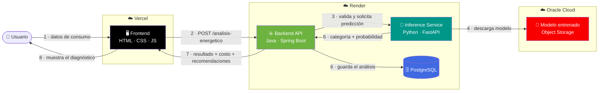

<div align="center">

# ⚡ EnergiAI

### Analizador Inteligente de Consumo Energético

Clasifica el perfil energético de una vivienda —**Eficiente**, **Moderado** o **Ineficiente**— a partir de su consumo, y devuelve costo estimado, probabilidad del modelo y recomendaciones de ahorro mediante una **API REST**.

<br>


**Hackathon ONE — Oracle Next Education (Alura + Oracle) × No Country**
`G9-LATAM-Team-39`

</div>

---

## 🔗 Demo en vivo

| Servicio | Enlace |
|---|---|
| 🖥️ **Aplicación (Frontend)** | [g9-latam-team39-frontend-chi.vercel.app](https://g9-latam-team39-frontend-chi.vercel.app/) |
| ☕ **API Backend (Swagger)** | [Documentación Swagger](https://energiai-backend-v274.onrender.com/swagger-ui/swagger-ui/index.html) |
| 🐍 **Servicio de Inferencia (FastAPI)** | [Documentación /docs](https://energiai-inference-service.onrender.com/docs) |

> ⚠️ Los servicios están en el plan gratuito de Render y pueden tardar ~30–60 s en "despertar" tras un periodo de inactividad. La primera petición puede ser lenta.

---

## 📋 Tabla de contenido

- [¿Qué hace?](#-qué-hace)
- [Arquitectura](#-arquitectura)
- [Stack tecnológico](#-stack-tecnológico)
- [Cómo funciona el flujo](#-cómo-funciona-el-flujo)
- [Estrategia de datos](#-estrategia-de-datos)
- [API REST](#-api-rest)
- [Ejecutar en local](#-ejecutar-en-local)
- [Equipo](#-equipo)
- [Créditos](#-créditos)

---

## 🎯 ¿Qué hace?

EnergiAI toma los datos de consumo de una vivienda y, mediante un modelo de machine learning entrenado con **microdatos reales de la ENCEVI 2018 (INEGI)**, clasifica su perfil de eficiencia energética. Devuelve:

- 🏷️ **Categoría** de eficiencia: Eficiente, Moderado o Ineficiente.
- 📊 **Probabilidad** de la predicción.
- 💰 **Costo mensual estimado** (tarifa de referencia de Brasil: **R$ 0,75/kWh**).
- 💡 **Recomendaciones** de ahorro personalizadas.
- 🔎 **Consulta posterior**: cada análisis se guarda y puede recuperarse con su código único.

---

## 🏗️ Arquitectura

Arquitectura de **microservicios** desplegada en la nube, con el modelo de ML servido desde **Oracle Cloud Infrastructure** (requisito obligatorio del hackathon).



### Componentes

| Componente | Tecnología | Despliegue | Responsabilidad |
|---|---|---|---|
| **Frontend** | HTML · CSS · JavaScript | Vercel | Captura de datos y visualización del resultado. |
| **Backend API** | Java 21 · Spring Boot | Render | Validación, orquestación, cálculo de costo, recomendaciones y persistencia. |
| **Inference Service** | Python · FastAPI · scikit-learn | Render | Carga el modelo desde OCI y ejecuta la inferencia. |
| **Base de datos** | PostgreSQL | Render | Almacena cada análisis para su consulta posterior. |
| **Modelo ML** | scikit-learn (`.joblib`) | OCI Object Storage | Modelo entrenado servido desde Oracle Cloud. |

---

## 🛠️ Stack tecnológico

**Backend**
`Java 21` · `Spring Boot 3.x` · `Maven` · `API REST` · `OpenAPI / Swagger` · `JPA / Hibernate`

**Data Science e Inferencia**
`Python 3.11` · `Pandas` · `scikit-learn` · `Joblib` · `FastAPI` · `Jupyter`

**Frontend**
`HTML5` · `CSS3` · `JavaScript (ES Modules)`

**Infraestructura y datos**
`Oracle Cloud Infrastructure (Object Storage)` · `Render` · `Vercel` · `PostgreSQL` · `Git / GitHub`

---

## 🔄 Cómo funciona el flujo

1. El usuario captura los datos de su vivienda en el **frontend**.
2. El frontend envía la solicitud al **backend Java** (`POST /analisis-energetico`).
3. El backend **valida** los datos de entrada.
4. El backend solicita la predicción al **servicio de inferencia** (Python).
5. El servicio de inferencia carga el **modelo desde OCI** y ejecuta la predicción, devolviendo categoría + probabilidad.
6. El backend **guarda el análisis** en PostgreSQL y completa el resultado con el costo estimado y las recomendaciones.
7. El frontend **presenta el diagnóstico** al usuario, junto con un código para consultarlo después.

---

## 📊 Estrategia de datos

El dataset se construye a partir de los **microdatos reales de la ENCEVI 2018 (INEGI)**, en dos pasos:

1. **Procesamiento** — se recorren las 13 tablas de la ENCEVI y se calcula el consumo aparato por aparato (potencia × horas × cantidad), produciendo una base de ~28,000 hogares con las variables del contrato.
2. **Etiquetado** — se agrega la columna `categoria` mediante un sistema de puntos multifactor (consumo, uso en horario pico, horas de alto consumo e intensidad), con umbrales calculados sobre los percentiles del propio dataset.

> `consumo_kwh` es una **estimación física**, no una lectura de medidor: la ENCEVI registra el monto pagado, no los kilovatios. Los criterios de cada perfil están documentados en `docs/reglas-etiquetado.md`.

---

## 🔌 API REST

### `POST /analisis-energetico`

Crea un nuevo análisis energético.

**Entrada:**
```json
{
  "consumoKwh": 420,
  "usoHorarioPico": true,
  "cantidadEquipos": 10,
  "tipoInmueble": "Casa",
  "equiposAltoConsumo": ["AIRE_ACONDICIONADO", "SECADORA_ROPA"]
}
```

**Salida:**
```json
{
  "id": "a3f1c9e2-5b7d-4e88-9c21-77f0b2d4e1a9",
  "categoria": "INEFICIENTE",
  "probabilidad": 0.81,
  "costoEstimadoMensual": 315.00,
  "moneda": "BRL",
  "recomendaciones": [
    "Reduce las horas de funcionamiento de los equipos de alto consumo.",
    "Evita utilizar varios equipos de alto consumo al mismo tiempo."
  ],
  "fechaAnalisis": "2026-08-20T18:40:00"
}
```

### `GET /analisis-energetico/{id}`

Recupera un análisis previamente guardado por su identificador.

> `costoEstimadoMensual = consumoKwh × 0.75` (tarifa de referencia **R$ 0,75/kWh**, contexto Brasil). El contrato completo vive en `docs/contrato-api.md`.

---

## 💻 Ejecutar en local

### Requisitos
- Java 21
- Python 3.11
- PostgreSQL
- Maven (incluido vía `./mvnw`)

### 1. Base de datos
```bash
sudo service postgresql start
sudo -u postgres psql -c "ALTER USER postgres PASSWORD 'tu_password';"
sudo -u postgres psql -c "CREATE DATABASE energiai;"
```

### 2. Servicio de inferencia (Python)
```bash
cd inference-service
python3 -m venv .venv
source .venv/bin/activate
pip install -r requirements.txt
uvicorn app.main:app --reload --port 8000
```

### 3. Backend (Java)
```bash
cd backend
export DB_PASSWORD='tu_password'
./mvnw spring-boot:run
```

### 4. Frontend
```bash
cd frontend
python3 -m http.server 5500
```

> Ajusta la URL del backend en `frontend/js/config.js` según tu entorno.

---

## 👥 Equipo

Proyecto desarrollado por el equipo **G9-LATAM-Team-39**:

| Integrante | Rol |
|---|---|
| **Sergio Tadeo Carrillo Montoya** | Data Science · Líder de equipo |
| **Fernando Contreras Albarrán** | Data Analyst |
| **Raúl Gilberto Muñoz González** | Data Science |
| **Brainer Fallas Prado** | Data Science |
| **Paul Stuart Ruiz Cabrera** | Backend |
| **Ivan Luviano Sixtos** | Backend |
| **Anderson Mateo Coello Jaramillo** | Backend · DevOps |


---

## 🏆 Créditos

Desarrollado durante el **Hackathon ONE** de **Oracle Next Education** (Alura Latam + Oracle), en colaboración con **No Country**.

<div align="center">

**⚡ EnergiAI** · 2026

</div>
